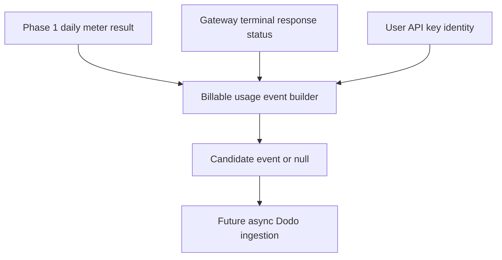

# Dodo Overage Billable Usage Event Contract

## Goal Capsule

- **Objective:** Prepare the smallest production-ready #4560 increment by defining a disabled-by-default billable API usage event contract that can feed future Dodo overage ingestion without putting Dodo calls on the request hot path.
- **Authority:** Issue #4560 and overlapping issue #3117 define the target architecture; current `origin/main` source is the executable Phase 1 contract because the issue-referenced Phase 1 plan path is not present in this checkout.
- **Scope:** Add a typed builder and focused tests around eligible billable usage events. Do not configure Dodo meters, send events, set prices, create spend caps, or subscribe to webhooks.
- **Stop condition:** The code exposes a tested payload contract that separates commercial overage eligibility from the existing per-minute burst and 10x ceiling limiter.

---

## Product Contract

### Summary

Phase 1 already meters per-account REST API usage and enforces only burst plus runaway ceiling behavior. Phase 2 needs that metered allowance to become billable overage through Dodo, but the epic still has unresolved commercial decisions. This increment creates the event contract that future async ingestion can consume once pricing and Dodo catalog decisions are resolved.

### Requirements

- R1. A billable event candidate MUST represent only commercial overage usage and MUST stay separate from the existing per-minute burst hard 429 and daily safety ceiling.
- R2. The event contract MUST include stable idempotency material so future Dodo ingestion can create deterministic `event_id` values.
- R3. The event contract MUST carry customer lookup inputs without requiring the gateway to know a Dodo customer id synchronously.
- R4. The event contract MUST reject unbillable outcomes, including 5xx handler failures, because #4560 flags billable 5xx treatment as a gating decision for live charging.
- R5. The increment MUST NOT send events to Dodo or introduce live overage charges before model, pricing, cycle, alerting, and spend-cap decisions are resolved.

### Scope Boundaries

- Deferred for later: Dodo meter creation, Dodo `POST /events/ingest`, customer-id resolution action, cron or `waitUntil` batching, 80%/100% credit balance emails, and customer spend caps.
- Outside this slice: changing `apiDailyAllowance` values, changing the 10x ceiling multiplier, or changing per-IP/per-account enforcement behavior.

### Sources

- Issue #4560: usage-based overage billing epic.
- Issue #3117: older Dodo metered billing tracker.
- `server/_shared/api-key-rate-limit.ts`: Phase 1 per-account burst and daily meter.
- `server/gateway.ts`: gateway chokepoint where Phase 1 meter is invoked before handler execution.
- `convex/payments/billing.ts`: existing userId to Dodo customer id resolver pattern for billing actions.

---

## Planning Contract

### Key Technical Decisions

- KTD1. Keep the increment pure and disabled. A pure builder can be validated without credentials and cannot accidentally bill customers.
- KTD2. Use userId as the customer lookup input. The gateway already has Clerk user identity for user API keys, while Convex owns the Dodo customer mapping.
- KTD3. Exclude failed server responses at the contract layer. Even if the final product decision evolves, this prevents future ingestion from billing 5xx by default.
- KTD4. Keep idempotency deterministic from user, UTC day, route, status, and observed count. Future batching can replay safely without duplicate event identity drift.

### High-Level Design

The current PR stops at `Candidate event or null`. Future work can enqueue or batch this object after Dodo catalog decisions are complete.

---

## Implementation Units

### U1. Add billable API usage event builder

- **Goal:** Create a pure helper that turns Phase 1 meter context plus terminal response status into a future Dodo overage event candidate or `null`.
- **Requirements:** R1, R2, R3, R4, R5
- **Files:**
  - Create: `server/_shared/api-overage-billing.ts`
  - Test: `tests/api-overage-billing.test.mts`
- **Patterns:**
  - `server/_shared/api-key-rate-limit.ts` for pure, injectable, no-Response helpers.
  - `tests/api-key-rate-limit.test.mts` for focused node:test coverage without live Redis or Dodo credentials.
- **Approach:** Export a typed `buildApiOverageUsageEvent` function that returns `null` unless the request is for an eligible paid user API key, the daily meter actually counted, the count is above the included allowance, and the terminal status is below 500. Include `meterId: "api.request"`, `eventId`, `userId`, `route`, `method`, `status`, `usageDate`, `quantity`, `dailyCount`, `includedAllowance`, and `idempotencyKey`.
- **Test Scenarios:**
  - Count at or below allowance returns `null`.
  - Count above allowance returns quantity equal to the overage delta for that request.
  - 5xx status returns `null`.
  - Missing user id or unmetered result returns `null`.
  - Idempotency material is stable for the same user, date, route, method, status, and count.
- **Verification:** Run `./node_modules/.bin/tsx --test tests/api-overage-billing.test.mts tests/api-key-rate-limit.test.mts`.

---

## Verification Contract

| Gate | Command | Done signal |
|---|---|---|
| Focused unit tests | `./node_modules/.bin/tsx --test tests/api-overage-billing.test.mts tests/api-key-rate-limit.test.mts` | New builder tests and existing meter tests pass. |
| API typecheck | `npm run typecheck:api` | Shared server helper compiles under API tsconfig. |

---

## Definition of Done

- U1 is implemented with focused tests and no live Dodo network calls.
- The PR body uses `Related to #4560`, not `Fixes #4560`, because this does not close the epic.
- The diff does not touch secrets, Dodo product pricing, live webhook handlers, or generated Convex artifacts.
